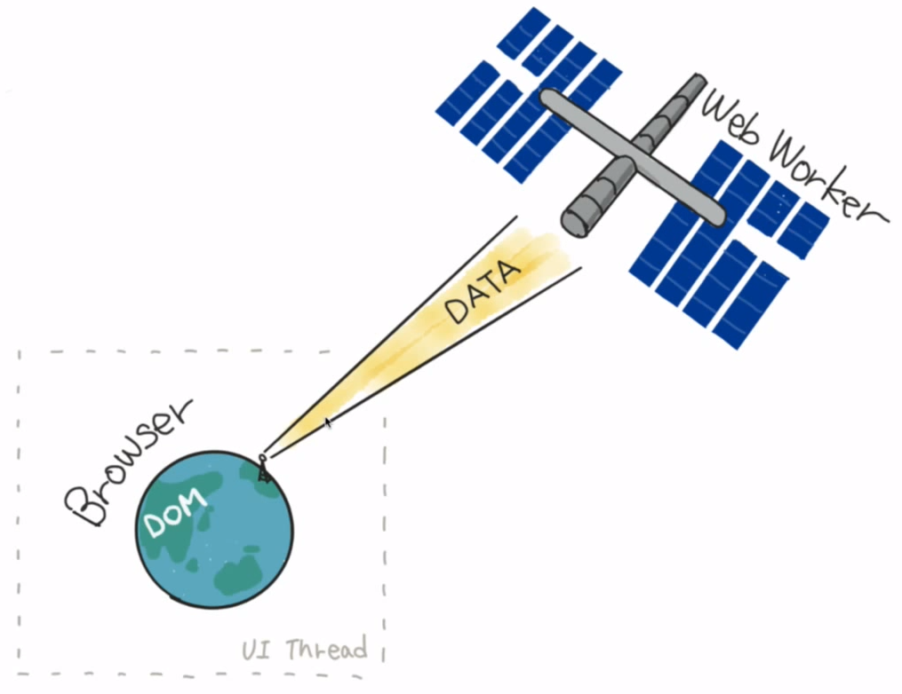
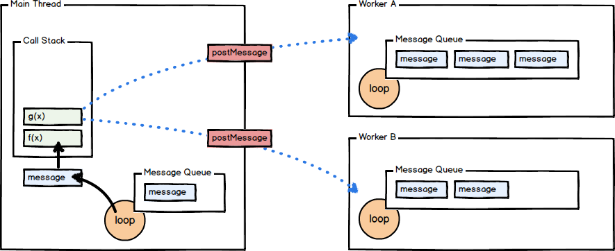

# HTML5 Web Workers API

Examples to demonstrate HTML5 Web Workers API

## References

- [Web Workers Demystified](https://medium.com/clockwork-nl/web-workers-demystified-fb4c84bd566c)
- [How to Avoid DOM Blocking in JavaScript](https://www.sitepoint.com/avoiding-dom-blocking/)
  - [Live Demo](https://codepen.io/SitePoint/pen/GzLPJV)
- [Web Workers API](https://developer.mozilla.org/en-US/docs/Web/API/Web_Workers_API/Using_web_workers)
- [Web Workers: Code Session - Supercharged](https://www.youtube.com/watch?v=X57mh8tKkgE)
- [Browser database comparison](http://nolanlawson.github.io/database-comparison/)
- [Sorting 50K Array with Bubble Sort](http://afshinm.github.io/50k/)

---
In case you have doubt why I'm not using semicolon is because I got inspiration from these talks:

- [Semicolons cannot save you!](https://www.youtube.com/watch?v=Qlr-FGbhKaI)
- [Are Semicolons Necessary in JavaScript?](https://www.youtube.com/watch?v=gsfbh17Ax9I)
